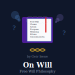

# On Will

A treatise on the subject of free will, of consciousness, subjective reality, including an interpretation of quantum mechanics - a Subjective Collapse Theory.

The home page of this and related articles, posts and discussions: http://isene.me/free-will/
